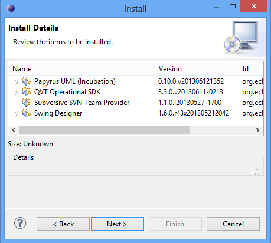
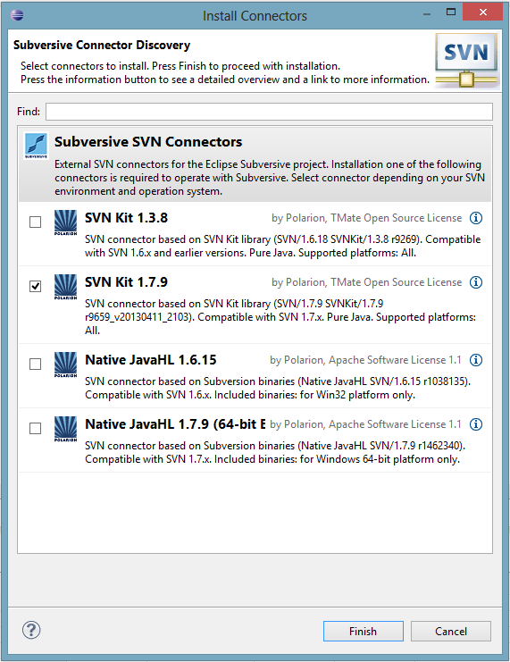

Please follow these steps to install and prepare Eclipse for the practical course on Model-driven Software Development.

1. Download the Eclipse IDE for Java and DSL Developers from [http://www.eclipse.org/downloads/packages/eclipse-ide-java-and-dsl-developers/keplerr](http://www.eclipse.org/downloads/packages/eclipse-ide-java-and-dsl-developers/keplerr). It includes Xtext (for implementing DSLs) and Xtend (useful for model-to-text transformations).

   * At least on Windows we observed some problems using Eclipse 64bit version with Xtext. To reduce compatibility issues **we recommend Eclipse's 32bit version**.
   
1. Unzip the archive to a folder of your choice.
1. Start *eclipse.exe* (or equivalent) in the eclipse folder.
1. Choose a folder for the Eclipse workspace.
1. Select **Help** > **Install new Software...**
2. From the dropdown menu, select **Kepler** as the site to work with.
1. Wait for the list of software to load and select all of the following items:  

   * **Modeling** > **QVT Operational SDK**  
      *for model-to-model transformations.*
   * **Modeling** > **Papyrus UML (Incubation)**  
      *for UML diagrams*
   * **Collaboration** > **Subversive SVN Team Provider**  
      *(even if you do not plan to use SVN, installing this allows you to actually install a SVN provider later, so that you are not prompted to select one any time Eclipse starts)*
   * **General Purpose Tools** > **Swing Designer**  
      *... optional, simplifies development of user interfaces with Swing.*

    
    Eclipse --> Install New Software...

    
    Selected new software for Eclipse

1. Click *Next* two times, check *Accept*, click *Finish* and wait for the packages to be installed.
1. Click Yes when prompted to restart.
1. When prompted during start-up (or after creating a project), select, for example, SVN Kit 1.7.x as Subversive SVN Connector (on a Win 32 system, you might want to choose Native JavaHL 1.7.x instead).

   
   Choose a SVN Connector

1. Again, click Next two times, check Accept, click Finish, confirm the Security Warning, and wait for the packages to be installed. Restart.

That's all! If you have any questions, feel free to ask them in the Learnweb discussion forum of this course.
