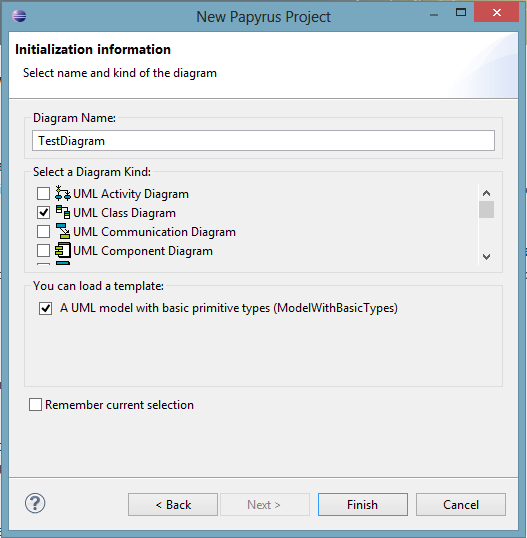

##Creating a new diagram##

1. Select *File* > *New* > *Project...*
1. Select *Papyrus* > *Papyrus Project* and click *Next*.
1. Choose a project name and click *Next*.
1. Select *UML* as *Diagram Language* and click *Next*.
1. Choose a name for your diagram, select *UML Class Diagram*, and load the template with basic primitive types.
    
    
    Create new Papyrus Project
    
1. Finish.

Select model elements from the palette on the right-hand side and add them to the diagram.
Properties and operations are likewise added to classes by selecting them and clicking on the respective class.

Associations can be found in the Edges section of the palette.
The Properties view provides additional options: 
right-click on an element and select Show Properties View.

##Creating and Applying a UML Profile##

1. Select  *File* > *New* > *Other...*
1. Select *Papyrus* > *Papyrus Model*.
1. Choose a file name and make sure that it will be created in the Papyrus project from above.
1. Select *Profile* as *Diagram Language*.
1. Choose a name for your profile and select *UML Profile Diagram*.

Stereotypes need to extend (Relationship "Extension") a metaclass such as "Class" (Import Metaclass) in order to be applicable to instances of this metaclass.
To apply a profile to a UML diagram, select the Profile tab in the properties view (left click in the canvas and select *Show Properties View*) of the model itself (click somewhere on the blank canvas) and click the "Apply profile" button (green plus sign).
Similarly, you can apply a stereotype to a model element, for example a class.
